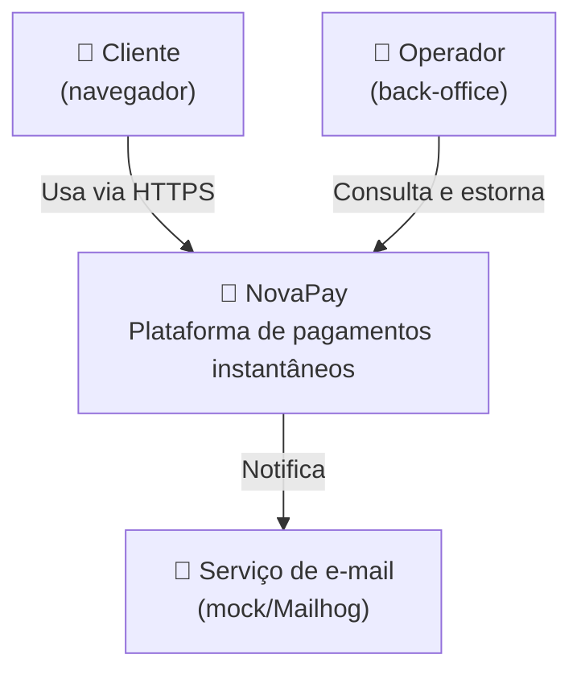
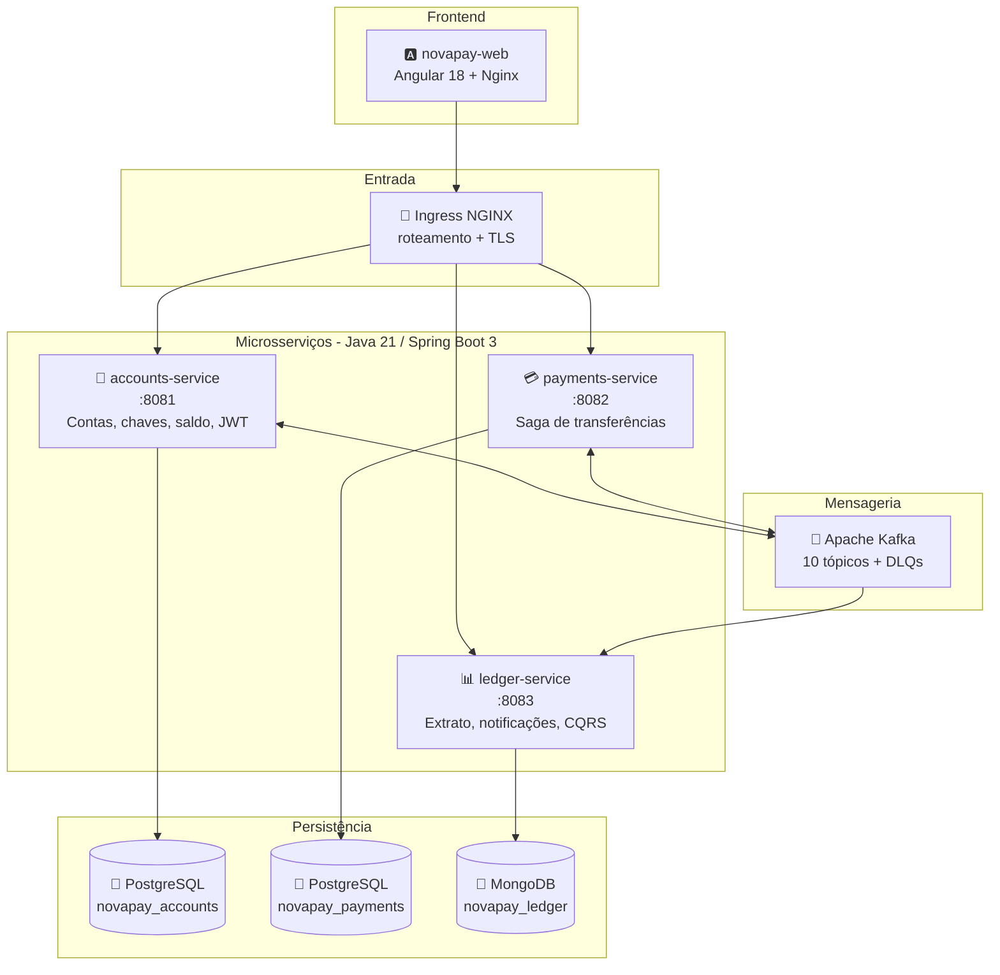
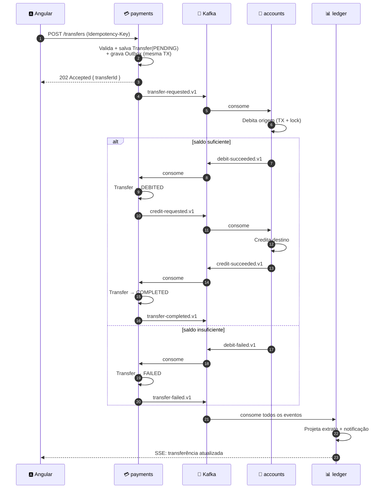
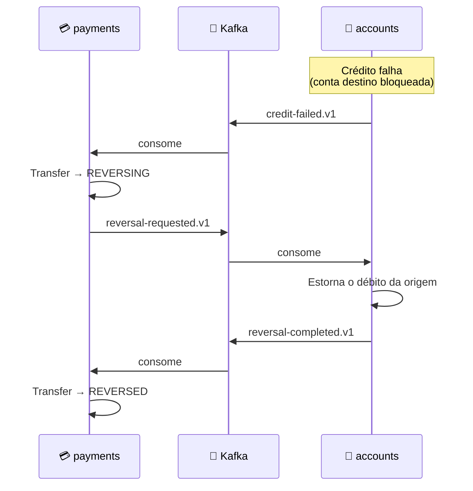
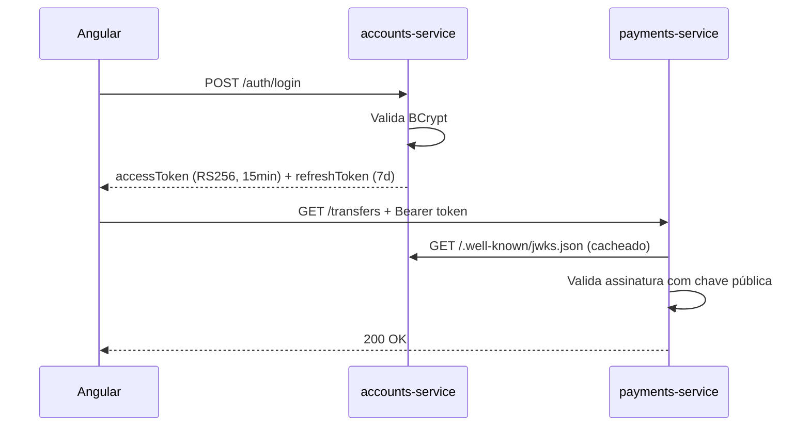

# 💸 NovaPay — Plataforma de Pagamentos Instantâneos

> Ecossistema de microsserviços para transferências instantâneas (estilo Pix), construído com **Java 21 + Spring Boot 3**, **Arquitetura Hexagonal**, **Kafka**, **PostgreSQL**, **MongoDB**, **Docker**, **Kubernetes**, **Azure** e front-end em **Angular 18**.


---

## 📑 Sumário

1. [Por que este projeto](#1-por-que-este-projeto)
2. [O domínio de negócio](#2-o-domínio-de-negócio)
3. [Mapa de skills → onde cada uma é exercitada](#3-mapa-de-skills--onde-cada-uma-é-exercitada)
4. [Arquitetura (C4)](#4-arquitetura-c4)
5. [Os três microsserviços](#5-os-três-microsserviços)
6. [O fluxo principal: a Saga da transferência](#6-o-fluxo-principal-a-saga-da-transferência)
7. [Padrões arquiteturais aplicados](#7-padrões-arquiteturais-aplicados)
8. [Requisitos Funcionais](#8-requisitos-funcionais)
9. [Requisitos Não Funcionais](#9-requisitos-não-funcionais)
10. [Modelo de dados](#10-modelo-de-dados)
11. [Contratos: REST e eventos Kafka](#11-contratos-rest-e-eventos-kafka)
12. [Estrutura hexagonal de pastas](#12-estrutura-hexagonal-de-pastas)
13. [Stack e dependências por serviço](#13-stack-e-dependências-por-serviço)
14. [Estratégia de testes](#14-estratégia-de-testes)
15. [Segurança](#15-segurança)
16. [Observabilidade](#16-observabilidade)
17. [Ambiente local (Docker Compose)](#17-ambiente-local-docker-compose)
18. [Kubernetes](#18-kubernetes)
19. [Azure](#19-azure)
20. [CI/CD com GitHub Actions](#20-cicd-com-github-actions)
21. [Fluxo Git e convenções](#21-fluxo-git-e-convenções)
22. [Roadmap de execução](#22-roadmap-de-execução)
23. [ADRs — decisões arquiteturais](#23-adrs--decisões-arquiteturais)
24. [Glossário de conceitos](#24-glossário-de-conceitos)
25. [Critérios de "portfólio pronto"](#25-critérios-de-portfólio-pronto)

---

## 1. Por que este projeto

A vaga-alvo é de **Analista Desenvolvedor Full Stack Sênior (Java | Cloud | Angular)** para um cliente do setor **bancário**. Um projeto de portfólio só convence um recrutador técnico quando ele resolve um problema **do mesmo domínio e com a mesma complexidade** que ele resolve no dia a dia.

Por isso o NovaPay não é um CRUD. Ele ataca os três problemas que realmente aparecem em entrevista sênior de banco:

| Problema real | Como o NovaPay resolve |
|---|---|
| "Como você garante que o dinheiro não some nem duplica entre microsserviços?" | Saga orquestrada + Transactional Outbox + idempotência |
| "Como você lida com um serviço fora do ar no meio de uma transferência?" | Compensação (estorno), retry com backoff, DLQ, circuit breaker |
| "Como você consulta 5 anos de extrato sem derrubar o banco transacional?" | CQRS: escrita no PostgreSQL, leitura projetada no MongoDB |

**A frase que você vai poder dizer numa entrevista:**
> "Implementei uma saga orquestrada com padrão outbox para garantir consistência eventual entre três microsserviços, com idempotência por chave de negócio, compensação automática e DLQ — tudo validado por testes de integração com Testcontainers e um E2E em Playwright."

Isso é discurso de sênior. E é verdade, porque você vai ter construído.

---

## 2. O domínio de negócio

**NovaPay** é uma plataforma de pagamentos instantâneos. Um cliente cadastra sua conta, registra uma **chave de pagamento** (e-mail, CPF ou aleatória), e transfere dinheiro para outro cliente em segundos — com extrato em tempo real e notificações.

### Personas

| Persona | O que faz |
|---|---|
| **Cliente** | Cadastra-se, faz login, registra chaves, consulta saldo, transfere, vê extrato |
| **Operador (back-office)** | Consulta transferências, força estorno, investiga transações travadas |
| **Sistema** | Processa eventos, projeta extratos, dispara notificações |

### Regras de negócio centrais (as que dão trabalho de verdade)

- **RN01** — Uma transferência só ocorre se o saldo disponível da origem for ≥ valor. Saldo nunca pode ficar negativo.
- **RN02** — A mesma requisição enviada duas vezes (mesmo `Idempotency-Key`) gera **uma única** transferência.
- **RN03** — Se o crédito no destino falhar, o débito na origem **deve ser estornado automaticamente**.
- **RN04** — Toda transferência tem um ciclo de vida auditável: `PENDING → DEBITED → COMPLETED` ou `→ FAILED → REVERSED`.
- **RN05** — Uma transferência não pode ter origem igual ao destino.
- **RN06** — Limite diário configurável por conta (padrão R$ 10.000). Transferências acima do limite são rejeitadas.
- **RN07** — Uma chave de pagamento é única em toda a plataforma e pertence a uma única conta.
- **RN08** — Valores monetários usam `BigDecimal` com escala 2 e `RoundingMode.HALF_EVEN`. **Nunca `double`.**

---

## 3. Mapa de skills → onde cada uma é exercitada

Esta tabela é o coração do projeto: cada skill exigida na vaga tem um endereço físico no código.

| Skill da vaga | Onde você pratica no NovaPay |
|---|---|
| **Java Sênior** | Records, sealed interfaces, pattern matching, Virtual Threads, Streams, `Optional`, `BigDecimal`, exceções customizadas, Value Objects imutáveis |
| **Spring Boot Sênior** | 3 aplicações completas: auto-configuration, profiles, `@ConfigurationProperties`, validation, `@Transactional`, scheduling, Actuator |
| **Arquitetura Hexagonal** | Estrutura `domain / application / infrastructure` nos 3 serviços, com **ArchUnit** barrando violação da regra de dependência |
| **APIs REST** | ~25 endpoints, versionamento `/api/v1`, HATEOAS opcional, paginação, `ProblemDetail` (RFC 7807), OpenAPI/Swagger |
| **Kafka / Mensageria** | 10 tópicos, producers, consumers, chaves de partição, consumer groups, retry topics, DLQ, Transactional Outbox |
| **Banco SQL (PostgreSQL)** | Modelagem relacional, índices, constraints, transações, lock otimista, Flyway migrations, query plan |
| **Banco NoSQL / MongoDB** | Read model do extrato, documentos aninhados, agregações, índices compostos, TTL index para notificações |
| **Testes (JUnit, Mockito)** | Testes de domínio puros, mocks nos use cases, `@WebMvcTest`, `@DataJpaTest`, Testcontainers, ArchUnit, mutation testing |
| **Docker** | Dockerfile multi-stage por serviço, imagens distroless, `docker-compose` com 12 contêineres, healthchecks |
| **Kubernetes** | Deployments, Services, Ingress, ConfigMaps, Secrets, probes, HPA, resource limits, Helm chart |
| **Cloud Azure** | AKS, ACR, PostgreSQL Flexible Server, Cosmos DB (API Mongo), Event Hubs (Kafka), Key Vault, Application Insights |
| **Git/GitHub Sênior** | Trunk-based, conventional commits, PR template, branch protection, GitHub Actions, releases semânticas |
| **Angular** | Standalone components, Signals, guards, interceptors, reactive forms, lazy loading, SSE para extrato ao vivo |
| **Design Patterns** | Saga, Outbox, CQRS, Strategy, Builder, Factory, Adapter, Repository, Specification, Circuit Breaker |
| **GitHub Actions / SonarQube** | Pipeline com build, testes, cobertura Jacoco, Quality Gate do Sonar, scan Trivy, push para ACR |
| **Scrum / Kanban / Agile** | Backlog em GitHub Projects, issues como user stories, Definition of Done, PRs pequenos |

---

## 4. Arquitetura (C4)

### Nível 1 — Contexto



### Nível 2 — Contêineres



> **Decisão importante:** cada serviço tem **seu próprio banco**. Nenhum serviço acessa a tabela de outro. Essa é a regra que transforma "3 apps" em "3 microsserviços de verdade" — e é a primeira coisa que um arquiteto olha no seu repositório.

---

## 5. Os três microsserviços

### 🏦 `accounts-service` — o guardião do dinheiro

**Bounded Context:** Cadastro e Saldo
**Banco:** PostgreSQL (ACID é inegociável para saldo)
**Porta:** 8081

| Responsabilidade | Detalhe |
|---|---|
| Cadastro de clientes e contas | CPF validado, senha com BCrypt |
| Autenticação | Emite JWT assinado em RS256; é o **único** emissor de token |
| Chaves de pagamento | Registro, listagem, exclusão, resolução `chave → conta` |
| Movimentação de saldo | Débito, crédito e estorno — **sempre via consumo de evento Kafka**, nunca via REST público |
| Idempotência | Tabela `processed_events` impede reprocessar o mesmo evento |

**Por que o saldo fica aqui e não no payments?** Porque saldo é um invariante de agregado: "o saldo nunca pode ser negativo" precisa ser garantido dentro de uma transação ACID sobre uma única linha. Se o saldo vivesse no payments, você teria dois donos da mesma verdade — o caminho mais rápido para dinheiro sumindo em produção.

---

### 💳 `payments-service` — o orquestrador

**Bounded Context:** Transferência
**Banco:** PostgreSQL (estado da saga precisa ser durável e transacional)
**Porta:** 8082

| Responsabilidade | Detalhe |
|---|---|
| Receber a ordem de transferência | `POST /api/v1/transfers` com `Idempotency-Key` |
| Máquina de estados | `PENDING → DEBITED → COMPLETED` / `FAILED` / `REVERSING` / `REVERSED` |
| Orquestração da saga | Publica comandos, escuta respostas, decide o próximo passo |
| Compensação | Se o crédito falha, dispara o estorno automaticamente |
| Outbox | Grava evento na mesma transação do estado — publicação garantida |
| Timeout | Job que marca como `FAILED` sagas paradas há mais de N minutos |

---

### 📊 `ledger-service` — a memória e a voz

**Bounded Context:** Extrato e Notificação
**Banco:** MongoDB (leitura rápida, documento desnormalizado, schema flexível)
**Porta:** 8083

| Responsabilidade | Detalhe |
|---|---|
| Projeção de extrato | Consome todos os eventos e monta o documento de extrato por conta |
| Consulta de extrato | Filtros por período, tipo, valor; paginação; agregações (total entrada/saída) |
| Notificações | Gera notificação a cada evento relevante, com TTL de 90 dias |
| Streaming ao vivo | Endpoint **SSE** que empurra a transferência para o Angular no instante em que ela completa |
| Auditoria | Guarda a timeline completa de eventos de cada transferência |

**Por que MongoDB aqui?** Extrato é leitura pesada, escrita append-only, e o documento é naturalmente desnormalizado (`{conta, data, valor, contraparte: {nome, chave}, ...}`). Em SQL isso viraria 4 JOINs por consulta. No Mongo é um `find` com índice composto. Esse é o argumento técnico que justifica "usar NoSQL" — e não "porque está na moda".

---

## 6. O fluxo principal: a Saga da transferência



### O caminho infeliz (compensação)



> **Conceito-chave que você vai dominar:** em sistemas distribuídos não existe `ROLLBACK` global. Existe **compensação** — uma nova operação que desfaz o efeito da anterior. É por isso que a saga é o padrão mais cobrado em entrevista sênior de banco.

---

## 7. Padrões arquiteturais aplicados

| Padrão | Problema que resolve | Onde está |
|---|---|---|
| **Arquitetura Hexagonal** | Domínio acoplado a framework e banco | Os 3 serviços |
| **Saga Orquestrada** | Transação distribuída sem 2PC | `payments-service` |
| **Transactional Outbox** | Evento publicado mas transação revertida (ou vice-versa) | `payments` e `accounts` |
| **Idempotent Consumer** | Kafka entrega "at-least-once" → evento duplicado | `accounts` e `ledger` |
| **CQRS** | Consulta pesada degradando a escrita | `payments` (write) + `ledger` (read) |
| **Dead Letter Queue** | Mensagem "venenosa" travando o consumer | Todos os consumers |
| **Circuit Breaker / Retry** | Serviço lento derrubando o chamador | Resilience4j nas chamadas REST |
| **Optimistic Locking** | Duas transferências simultâneas na mesma conta | `@Version` em `Account` |
| **Value Object** | Primitive obsession (`String cpf`, `double valor`) | `Cpf`, `Money`, `PaymentKey` |
| **Specification** | Queries dinâmicas de back-office | `payments-service` |
| **Strategy** | Múltiplos tipos de chave (CPF, e-mail, aleatória) | `accounts-service` |
| **Anti-Corruption Layer** | Modelo externo vazando para o domínio | Mappers em `infrastructure` |

---

## 8. Requisitos Funcionais

### 🏦 accounts-service

| ID | Requisito | Critério de aceite |
|---|---|---|
| RF01 | Cadastrar cliente | CPF válido e único, e-mail único, senha ≥ 8 chars com BCrypt. Cria conta com saldo 0. |
| RF02 | Autenticar | `POST /auth/login` retorna access token (15 min) + refresh token (7 dias) |
| RF03 | Renovar token | `POST /auth/refresh` com refresh válido e não revogado |
| RF04 | Logout | Revoga o refresh token |
| RF05 | Consultar perfil | `GET /accounts/me` com CPF mascarado (`***.456.789-**`) |
| RF06 | Registrar chave de pagamento | Máx. 5 por conta; única globalmente; tipos CPF / EMAIL / RANDOM |
| RF07 | Listar e excluir chaves | Só o dono pode excluir |
| RF08 | Resolver chave | `GET /keys/{valor}/resolve` → dados mascarados do titular (para confirmação antes de transferir) |
| RF09 | Consultar saldo | Saldo total, disponível e bloqueado |
| RF10 | Debitar conta (evento) | Consome `transfer-requested`; valida saldo e limite; emite sucesso ou falha |
| RF11 | Creditar conta (evento) | Consome `credit-requested`; valida conta ativa |
| RF12 | Estornar (evento) | Consome `reversal-requested`; devolve o valor à origem |
| RF13 | Configurar limite diário | Cliente ajusta entre R$ 100 e R$ 50.000 |

### 💳 payments-service

| ID | Requisito | Critério de aceite |
|---|---|---|
| RF14 | Iniciar transferência | `POST /transfers` → 202 Accepted com `transferId`; header `Idempotency-Key` obrigatório |
| RF15 | Idempotência | Mesma chave + mesmo payload → mesma resposta. Mesma chave + payload diferente → 422 |
| RF16 | Consultar transferência | `GET /transfers/{id}` com status e timeline |
| RF17 | Listar transferências | Filtros por status, período, valor mín/máx; paginado |
| RF18 | Orquestrar saga | Avança a máquina de estados conforme os eventos recebidos |
| RF19 | Compensar automaticamente | Crédito falhou → estorno disparado sem intervenção humana |
| RF20 | Timeout de saga | Saga em `PENDING`/`DEBITED` há > 5 min → investigação/falha |
| RF21 | Estorno manual (back-office) | `POST /transfers/{id}/reverse` restrito a `ROLE_OPERATOR` |
| RF22 | Agendar transferência | Data futura; job diário dispara as agendadas *(fase 4)* |

### 📊 ledger-service

| ID | Requisito | Critério de aceite |
|---|---|---|
| RF23 | Projetar extrato | Cada evento vira um lançamento no documento de extrato da conta |
| RF24 | Consultar extrato | Filtros por período, tipo (entrada/saída), valor; paginado |
| RF25 | Resumo do período | Agregação Mongo: total de entradas, saídas, saldo líquido, contagem |
| RF26 | Timeline de transferência | Sequência completa de eventos com timestamps |
| RF27 | Notificações | Lista paginada, marcar como lida, contador de não lidas |
| RF28 | Stream ao vivo | `GET /stream/notifications` via SSE, autenticado |
| RF29 | Exportar extrato | CSV e PDF *(fase 4)* |

### 🅰️ novapay-web (Angular)

| ID | Requisito |
|---|---|
| RF30 | Telas de cadastro e login com validação reativa |
| RF31 | Dashboard com saldo, últimas 5 transações e ações rápidas |
| RF32 | Fluxo de transferência em 3 passos: chave → valor → confirmação |
| RF33 | Feedback de status em tempo real (badge muda de "Processando" para "Concluída" via SSE) |
| RF34 | Extrato com filtros, paginação e gráfico de entradas x saídas |
| RF35 | Gestão de chaves de pagamento |
| RF36 | Centro de notificações com contador |
| RF37 | Guard de rota + interceptor que renova o token automaticamente no 401 |

---

## 9. Requisitos Não Funcionais

| ID | Categoria | Requisito | Meta mensurável |
|---|---|---|---|
| RNF01 | Performance | Latência da API de escrita | p95 < 300 ms |
| RNF02 | Performance | Latência da consulta de extrato | p95 < 150 ms |
| RNF03 | Performance | Tempo total da saga (feliz) | p95 < 3 s |
| RNF04 | Escalabilidade | Throughput | ≥ 500 transferências/min com 3 réplicas |
| RNF05 | Escalabilidade | Auto-scaling | HPA entre 2 e 10 pods a 70% de CPU |
| RNF06 | Resiliência | Nenhum ponto único de falha | Mín. 2 réplicas por serviço |
| RNF07 | Resiliência | Falha de consumer | 3 retries com backoff exponencial, depois DLQ |
| RNF08 | Resiliência | Circuit breaker | Abre a 50% de falha em janela de 10 chamadas |
| RNF09 | Consistência | Zero perda de dinheiro | Soma dos saldos + em trânsito = constante (teste invariante) |
| RNF10 | Consistência | Idempotência | Evento duplicado **nunca** duplica lançamento |
| RNF11 | Disponibilidade | Uptime alvo | 99,9% |
| RNF12 | Segurança | JWT RS256 | Access 15 min, refresh 7 dias rotativo |
| RNF13 | Segurança | Senhas | BCrypt cost 12, nunca em log |
| RNF14 | Segurança | Rate limiting | 5 tentativas de login / min / IP |
| RNF15 | Segurança | Dependências | Zero vulnerabilidade HIGH/CRITICAL (Trivy) |
| RNF16 | Segurança / LGPD | Dados sensíveis | CPF mascarado em resposta e em log |
| RNF17 | Observabilidade | Logs | JSON estruturado com `traceId` e `correlationId` |
| RNF18 | Observabilidade | Métricas | Actuator + Prometheus + dashboards Grafana |
| RNF19 | Observabilidade | Tracing | OpenTelemetry ponta a ponta, incluindo o salto via Kafka |
| RNF20 | Observabilidade | Health checks | `/actuator/health/liveness` e `/readiness` |
| RNF21 | Qualidade | Cobertura de testes | ≥ 80% de linhas, ≥ 90% no pacote `domain` |
| RNF22 | Qualidade | Quality Gate | SonarQube verde obrigatório para merge |
| RNF23 | Qualidade | Regra hexagonal | ArchUnit falha o build se `domain` importar Spring/JPA |
| RNF24 | Manutenibilidade | Documentação de API | OpenAPI 3 gerado e publicado |
| RNF25 | Manutenibilidade | Migrations | Flyway versionado, nunca `ddl-auto: update` |
| RNF26 | Portabilidade | Subir tudo localmente | `docker compose up` em um comando |
| RNF27 | Portabilidade | Imagens | Multi-stage, imagem final < 250 MB, usuário não-root |

---

## 10. Modelo de dados

### PostgreSQL — `novapay_accounts`

```
customers          accounts              payment_keys
──────────         ─────────             ────────────
id (uuid) PK       id (uuid) PK          id (uuid) PK
full_name          customer_id FK        account_id FK
cpf UNIQUE         number UNIQUE         key_type (CPF|EMAIL|RANDOM)
email UNIQUE       branch                key_value UNIQUE
password_hash      balance NUMERIC(19,2) created_at
status             blocked NUMERIC(19,2)
created_at         daily_limit
                   status
                   version  ← lock otimista

ledger_entries              processed_events        refresh_tokens
──────────────              ────────────────        ──────────────
id (uuid) PK                event_id PK             id PK
account_id FK               consumer_group          token_hash
transfer_id                 processed_at            customer_id
direction (DEBIT|CREDIT)                            expires_at
amount NUMERIC(19,2)                                revoked
balance_after
created_at
```

### PostgreSQL — `novapay_payments`

```
transfers                     transfer_events            outbox_messages
─────────                     ───────────────            ───────────────
id (uuid) PK                  id PK                      id PK
idempotency_key UNIQUE        transfer_id FK             aggregate_id
source_account_id             status                     topic
target_account_id             reason                     payload (jsonb)
target_key                    occurred_at                created_at
amount NUMERIC(19,2)                                     published_at (null = pendente)
description                                              attempts
status
failure_reason
created_at / updated_at
version
```

**Índices que importam:**
`accounts(number)`, `payment_keys(key_value)`, `transfers(idempotency_key)`, `transfers(source_account_id, created_at DESC)`, `outbox_messages(published_at) WHERE published_at IS NULL` *(índice parcial — detalhe que impressiona)*.

### MongoDB — `novapay_ledger`

```javascript
// coleção: statements  (1 documento por lançamento)
{
  _id: ObjectId,
  accountId: "uuid",
  transferId: "uuid",
  direction: "IN" | "OUT",
  amount: NumberDecimal("150.00"),
  balanceAfter: NumberDecimal("850.00"),
  counterparty: { name: "M*** S***", key: "***@email.com", bank: "NovaPay" },
  description: "Almoço",
  status: "COMPLETED",
  occurredAt: ISODate(),
  tags: ["transfer", "pix"]
}

// coleção: transfer_timelines  (auditoria — 1 doc por transferência)
{
  _id: "transferId",
  events: [ { type, payload, occurredAt, service } ],
  currentStatus: "COMPLETED",
  durationMs: 1840
}

// coleção: notifications  (TTL 90 dias)
{
  _id, accountId, type, title, message, read: false,
  createdAt: ISODate(),   // índice TTL: expireAfterSeconds: 7776000
  metadata: { transferId, amount }
}
```

**Índices:** `{accountId: 1, occurredAt: -1}` (composto, o mais importante), `{transferId: 1}`, `{accountId: 1, read: 1}`, TTL em `notifications.createdAt`.

---

## 11. Contratos: REST e eventos Kafka

### Endpoints principais

| Método | Rota | Serviço | Auth |
|---|---|---|---|
| `POST` | `/api/v1/customers` | accounts | público |
| `POST` | `/api/v1/auth/login` | accounts | público |
| `POST` | `/api/v1/auth/refresh` | accounts | público |
| `GET` | `/api/v1/accounts/me` | accounts | JWT |
| `GET` | `/api/v1/accounts/me/balance` | accounts | JWT |
| `POST` | `/api/v1/keys` | accounts | JWT |
| `GET` | `/api/v1/keys/{value}/resolve` | accounts | JWT |
| `POST` | `/api/v1/transfers` | payments | JWT + `Idempotency-Key` |
| `GET` | `/api/v1/transfers/{id}` | payments | JWT |
| `GET` | `/api/v1/transfers` | payments | JWT |
| `POST` | `/api/v1/transfers/{id}/reverse` | payments | `ROLE_OPERATOR` |
| `GET` | `/api/v1/statements` | ledger | JWT |
| `GET` | `/api/v1/statements/summary` | ledger | JWT |
| `GET` | `/api/v1/notifications` | ledger | JWT |
| `GET` | `/api/v1/stream/notifications` | ledger | JWT (SSE) |

### Tópicos Kafka

| Tópico | Produtor | Consumidores | Chave de partição | Partições |
|---|---|---|---|---|
| `novapay.transfer-requested.v1` | payments | accounts, ledger | `sourceAccountId` | 3 |
| `novapay.debit-succeeded.v1` | accounts | payments, ledger | `transferId` | 3 |
| `novapay.debit-failed.v1` | accounts | payments, ledger | `transferId` | 3 |
| `novapay.credit-requested.v1` | payments | accounts | `targetAccountId` | 3 |
| `novapay.credit-succeeded.v1` | accounts | payments, ledger | `transferId` | 3 |
| `novapay.credit-failed.v1` | accounts | payments, ledger | `transferId` | 3 |
| `novapay.reversal-requested.v1` | payments | accounts | `sourceAccountId` | 3 |
| `novapay.reversal-completed.v1` | accounts | payments, ledger | `transferId` | 3 |
| `novapay.transfer-completed.v1` | payments | ledger | `transferId` | 3 |
| `novapay.transfer-failed.v1` | payments | ledger | `transferId` | 3 |
| `*.dlq` | infra | operador | — | 1 |

**Por que a chave de partição é a conta e não a transferência nos tópicos de movimentação?** Porque o Kafka garante ordem **dentro de uma partição**. Todos os débitos da mesma conta precisam ser processados em ordem para o saldo não bagunçar. Esse detalhe é exatamente o tipo de coisa que separa quem "usou Kafka" de quem "entende Kafka".

### Envelope padrão dos eventos

```json
{
  "eventId": "uuid",
  "eventType": "DebitSucceeded",
  "version": 1,
  "occurredAt": "2026-03-10T14:22:31.115Z",
  "correlationId": "uuid",
  "causationId": "uuid",
  "payload": { }
}
```

---

## 12. Estrutura hexagonal de pastas

Padrão idêntico nos três serviços (exemplo: `accounts-service`):

```
com.novapay.accounts
│
├── domain/                      ← ZERO dependência de framework
│   ├── model/
│   │   ├── Account.java             (entidade rica, com comportamento)
│   │   ├── Customer.java
│   │   ├── PaymentKey.java
│   │   └── vo/  Money.java, Cpf.java, AccountNumber.java
│   ├── exception/
│   │   ├── InsufficientBalanceException.java
│   │   └── DailyLimitExceededException.java
│   └── service/  DailyLimitPolicy.java
│
├── application/                 ← casos de uso; conhece só o domínio
│   ├── port/
│   │   ├── in/   DebitAccountUseCase.java, RegisterKeyUseCase.java
│   │   └── out/  AccountRepositoryPort.java, EventPublisherPort.java
│   └── usecase/  DebitAccountService.java, RegisterKeyService.java
│
├── infrastructure/              ← todos os adaptadores
│   ├── in/
│   │   ├── rest/       AccountController.java, dto/, mapper/, GlobalExceptionHandler.java
│   │   └── messaging/  TransferRequestedConsumer.java
│   └── out/
│       ├── persistence/ AccountJpaEntity.java, AccountRepositoryAdapter.java
│       └── messaging/   KafkaEventPublisher.java, OutboxPoller.java
│
└── config/  SecurityConfig.java, KafkaConfig.java, BeanConfig.java
```

### A regra de dependência (o coração do hexagonal)

```
infrastructure ──→ application ──→ domain
                                      ↑
                          (não aponta para ninguém)
```

Nenhuma seta volta. `domain` não importa `org.springframework`, não importa `jakarta.persistence`. Se amanhã trocarmos PostgreSQL por Cassandra, ou REST por gRPC, **o domínio não muda uma linha**.

E isso não fica na base da confiança — o **ArchUnit** verifica no build:

```java
@ArchTest
static final ArchRule dominio_nao_depende_de_framework =
    noClasses().that().resideInAPackage("..domain..")
        .should().dependOnClassesThat()
        .resideInAnyPackage("org.springframework..", "jakarta.persistence..");
```

---

## 13. Stack e dependências por serviço

### Comuns aos três

| Dependência | Para quê |
|---|---|
| `spring-boot-starter-web` | API REST |
| `spring-boot-starter-validation` | Bean Validation (`@NotNull`, `@Positive`) |
| `spring-boot-starter-actuator` | Health, metrics, info |
| `spring-kafka` | Producer e consumer |
| `springdoc-openapi-starter-webmvc-ui` | Swagger UI |
| `micrometer-registry-prometheus` | Métricas |
| `micrometer-tracing-bridge-otel` + `opentelemetry-exporter-otlp` | Tracing distribuído |
| `mapstruct` | Mapeamento DTO ↔ domínio ↔ entidade |
| `lombok` | Boilerplate (**restrito a `infrastructure`**; o domínio é escrito à mão) |
| `spring-boot-starter-test`, `assertj`, `mockito` | Testes |
| `testcontainers` (postgres / mongodb / kafka) | Testes de integração reais |
| `archunit-junit5` | Guarda da arquitetura |

### accounts-service

`spring-boot-starter-data-jpa` · `postgresql` · `flyway-core` · `spring-boot-starter-security` · `spring-boot-starter-oauth2-resource-server` · `nimbus-jose-jwt` · `bucket4j` (rate limit)

### payments-service

`spring-boot-starter-data-jpa` · `postgresql` · `flyway-core` · `spring-boot-starter-oauth2-resource-server` · `resilience4j-spring-boot3` · `spring-statemachine-core` *(opcional — avaliar se agrega ou complica)*

### ledger-service

`spring-boot-starter-data-mongodb` · `spring-boot-starter-oauth2-resource-server` · `spring-boot-starter-webflux` *(só para o SSE)*

### novapay-web (Angular 18)

`@angular/core` 18 (standalone + signals) · **TailwindCSS 3** + `@angular/cdk` (para overlays/a11y sem trazer o Material inteiro) · `rxjs` · `ngx-mask` · `chart.js` + `ng2-charts` · `jest` · `@playwright/test`

> **Decisão (ADR 010):** Tailwind em vez de Angular Material. O Material entrega telas prontas, mas todas se parecem — um recrutador reconhece o tema padrão em dois segundos. Com Tailwind você constrói o próprio design system (tokens de cor, escala de espaçamento, tipografia), o que demonstra domínio de CSS moderno e dá identidade visual ao projeto. O `@angular/cdk` entra só para o que é trabalhoso de fazer à mão com acessibilidade correta: modal, dropdown e gestão de foco.

---

## 14. Estratégia de testes

### A pirâmide

```
           ╱╲
          ╱E2E╲          ~5 cenários — Playwright, fluxo completo no navegador
         ╱──────╲
        ╱Integr. ╲       ~40 testes — Testcontainers (Postgres, Mongo, Kafka reais)
       ╱──────────╲
      ╱  Unitários ╲     ~200 testes — JUnit 5 + Mockito, rápidos e isolados
     ╱──────────────╲
```

| Camada | Ferramenta | O que testa | Exemplo |
|---|---|---|---|
| **Domínio** | JUnit 5 puro, sem Spring | Regras de negócio | "debitar acima do saldo lança `InsufficientBalanceException`" |
| **Use case** | JUnit + Mockito | Orquestração, com portas mockadas | "ao debitar com sucesso, publica `DebitSucceeded` exatamente uma vez" |
| **Controller** | `@WebMvcTest` + MockMvc | Serialização, validação, status HTTP | "POST sem `Idempotency-Key` retorna 400 com ProblemDetail" |
| **Persistência** | `@DataJpaTest` + Testcontainers | Queries, constraints, lock | "saldo negativo viola a constraint do banco" |
| **Mensageria** | `@SpringBootTest` + Kafka container | Produção e consumo reais | "evento duplicado não gera segundo lançamento" |
| **Arquitetura** | ArchUnit | Regra de dependência hexagonal | "`domain` não importa Spring" |
| **Contrato** | WireMock / Spring Cloud Contract | Integração entre serviços | "resolve de chave inexistente → 404" |
| **Mutação** | PIT (pitest) | Qualidade *real* dos testes | Mutation score ≥ 60% no domínio |
| **Carga** | k6 ou Gatling | RNF de performance | 500 transferências/min sem erro |
| **E2E** | Playwright | Jornada do usuário | cadastro → login → chave → transferência → extrato atualizado |

### O teste que vale ouro

Um **teste de invariante**: gera 100 transferências concorrentes entre 10 contas e verifica que a soma total dos saldos é exatamente igual à do início. Se algum dinheiro sumiu ou duplicou, o teste quebra. Coloque isso no README do repositório final — recrutador técnico nota.

---

## 15. Segurança

### Fluxo de autenticação



**Por que RS256 e não HS256?** Com HS256 (chave simétrica) todo microsserviço precisa conhecer o segredo — e qualquer um deles poderia forjar um token. Com RS256, apenas o `accounts-service` tem a chave privada; os outros validam com a chave pública via JWKS. É assim que se faz em banco.

### Checklist de segurança

- [ ] Senhas com BCrypt cost 12
- [ ] Access token curto + refresh token rotativo (invalida o anterior a cada uso)
- [ ] Autorização por `@PreAuthorize` com `ROLE_CUSTOMER` / `ROLE_OPERATOR`
- [ ] Validação de que a conta do token é a dona do recurso (prevenção de IDOR)
- [ ] Rate limit no login (Bucket4j)
- [ ] CORS restrito à origem do front
- [ ] Headers de segurança (HSTS, X-Content-Type-Options, CSP)
- [ ] Secrets fora do código: `.env` local, Secret no K8s, Key Vault na Azure
- [ ] CPF e e-mail mascarados em respostas e logs
- [ ] Trivy no CI bloqueando CVEs HIGH/CRITICAL
- [ ] Contêineres rodando com usuário não-root

---

## 16. Observabilidade

| Pilar | Ferramenta | Entregável |
|---|---|---|
| **Logs** | Logback + JSON encoder + Loki | Todo log carrega `traceId` e `correlationId` |
| **Métricas** | Micrometer → Prometheus → Grafana | Dashboard com taxa de transferências, latência p95, saldo de DLQ, lag dos consumers |
| **Tracing** | OpenTelemetry → Jaeger | Trace único atravessando Angular → payments → Kafka → accounts → ledger |
| **Health** | Actuator | `liveness` e `readiness` separados (o K8s precisa disso) |
| **Alertas** | Alertmanager | DLQ > 0, lag > 1000, taxa de erro > 1% |

**Métricas de negócio customizadas** (`@Counted` / `@Timed`): `novapay.transfers.completed`, `novapay.transfers.failed`, `novapay.saga.duration`, `novapay.compensations.triggered`.

---

## 17. Ambiente local (Docker Compose)

| Contêiner | Porta | Uso |
|---|---|---|
| `postgres-accounts` | 5432 | Banco do accounts |
| `postgres-payments` | 5433 | Banco do payments |
| `mongodb` | 27017 | Banco do ledger |
| `kafka` (KRaft, sem Zookeeper) | 9092 | Broker |
| `kafka-ui` | 8080 | Inspecionar tópicos e mensagens |
| `accounts-service` | 8081 | — |
| `payments-service` | 8082 | — |
| `ledger-service` | 8083 | — |
| `novapay-web` | 4200 | Angular via Nginx |
| `prometheus` | 9090 | Métricas |
| `grafana` | 3000 | Dashboards |
| `jaeger` | 16686 | Traces |
| `sonarqube` | 9000 | Análise de código |

```bash
make up        # sobe tudo
make seed      # popula contas de teste
make test      # roda a suíte completa
make logs s=payments
make down
```

---

## 18. Kubernetes

```
k8s/
├── base/
│   ├── namespace.yaml
│   ├── accounts/    deployment, service, configmap, secret, hpa
│   ├── payments/    deployment, service, configmap, secret, hpa
│   ├── ledger/      deployment, service, configmap, secret, hpa
│   ├── web/         deployment, service
│   └── ingress.yaml
├── overlays/
│   ├── local/       (kind) + statefulsets de postgres, mongo, kafka
│   └── azure/       (AKS) usando serviços gerenciados
└── helm/novapay/    chart parametrizado
```

Conceitos que você vai praticar de fato: **probes** (liveness ≠ readiness ≠ startup), `resources.requests/limits`, **HPA**, `RollingUpdate` com `maxUnavailable: 0`, ConfigMap vs Secret, PodDisruptionBudget, e o clássico "por que meu pod está em `CrashLoopBackOff`".

---

## 19. Azure

| Componente local | Equivalente na Azure |
|---|---|
| Kubernetes (kind) | **AKS** — Azure Kubernetes Service |
| Imagens Docker locais | **ACR** — Azure Container Registry |
| PostgreSQL | **Azure Database for PostgreSQL Flexible Server** |
| MongoDB | **Azure Cosmos DB for MongoDB** |
| Kafka | **Azure Event Hubs** (protocolo Kafka — só troca o bootstrap server) |
| `.env` | **Azure Key Vault** + Workload Identity |
| Jaeger/Prometheus | **Application Insights** + Azure Monitor |
| Angular Nginx | **Azure Static Web Apps** |

> ⚠️ **Custo:** essa stack completa não cabe no crédito gratuito por muito tempo. Estratégia recomendada: desenvolver **100% local** com kind, e subir na Azure apenas na Fase 5, por 2–3 dias, para gravar evidências (prints, vídeo curto, `kubectl get pods` no AKS) e então destruir com `terraform destroy`. Isso é o que você mostra no portfólio — ninguém espera que você mantenha um cluster pago no ar.

---

## 20. CI/CD com GitHub Actions

```
.github/workflows/
├── ci.yml          → em todo PR
├── cd.yml          → em merge na main
└── pr-checks.yml   → título do PR, tamanho, template
```

**Pipeline `ci.yml`:**
1. Checkout + cache do Maven
2. Build (`mvn verify -T 1C`)
3. Testes unitários + integração (Testcontainers no runner)
4. Relatório Jacoco → falha se cobertura < 80%
5. ArchUnit (já roda no `verify`)
6. SonarQube Quality Gate
7. Lint + testes do Angular
8. Build das imagens Docker
9. Trivy scan → falha em HIGH/CRITICAL

**Pipeline `cd.yml`:** tag semântica → push para ACR → `helm upgrade --install` no AKS → smoke test → rollback automático se o smoke falhar.

---

## 21. Fluxo Git e convenções

- **Trunk-based** com branches curtas: `feat/RF14-iniciar-transferencia`
- **Conventional Commits**: `feat(payments): implementa saga de transferência`
- PR com no máximo ~400 linhas, template com checklist, self-review antes de pedir revisão
- `main` protegida: CI verde + 1 aprovação obrigatórios
- Releases com **SemVer** e CHANGELOG gerado

> O histórico do Git **é parte do portfólio**. Um recrutador que abre 80 commits bem escritos, com PRs descritivos, vê um profissional. Um que abre `commit 1`, `ajustes`, `agora vai` vê um estudante. Trate o Git como entregável.

---

## 22. Roadmap de execução

### ⏱️ Premissas de execução

- **Dedicação:** 8–10h/dia, imersão total
- **Prazo:** flexível — o critério de conclusão não é a data, é o **domínio**
- **Objetivo declarado:** conseguir defender cada decisão e cada linha em uma sabatina técnica sênior

Isso muda a estratégia. Em vez de correr atrás de uma fatia vertical em 7 dias, vamos por **sprints temáticos**: cada sprint mergulha fundo em um bloco de conceitos, entrega código funcionando e termina com uma **Prova de Domínio** — perguntas que você precisa responder sem consultar nada. Se travar em alguma, o sprint não acabou.

**Duração estimada: 30 a 35 dias úteis.** Pode esticar. Sprint que você não consegue explicar é sprint que não terminou.

---

### 📐 O método (leia antes de começar)

Dominar não é "fazer funcionar". É isto, em quatro camadas:

1. **Construir** — escrever o código com meu acompanhamento, entendendo cada decisão
2. **Explicar em voz alta** — ao fim de cada dia, explique o que fez como se estivesse ensinando alguém. Travou? Não entendeu de verdade.
3. **Quebrar de propósito** — cada sprint tem **Drills de Quebra**: derrube o Kafka, mate um pod, duplique um evento, force um deadlock. Ver o sistema falhar ensina 10× mais que vê-lo funcionar.
4. **Reescrever do zero** — ao final, apague um dos serviços e refaça sozinho, sem consultar. É aqui que o conhecimento vira seu.

> A Prova de Domínio de cada sprint é simulação de entrevista real. Leve a sério — é literalmente o que vão te perguntar.

---

### 🏗️ Sprint 0 — Fundação (Dia 1)

| Item | Detalhe |
|---|---|
| **Entregáveis** | Monorepo, `parent-pom.xml`, 3 módulos Spring Boot subindo, `docker-compose` com Postgres ×2 + Mongo + Kafka + Kafka UI, Makefile, `.gitignore`, repositório no GitHub com branch protegida |
| **Conceitos** | Maven multi-módulo, gerenciamento de dependências, profiles do Spring, redes e volumes no Docker, Kafka em modo KRaft |
| **Drills de quebra** | Suba a aplicação com o banco desligado e leia o stack trace inteiro. Mude a porta do Kafka e veja o erro do producer. |
| **Prova de Domínio** | Por que `dependencyManagement` e não `dependencies` no pai? O que o `depends_on` do Compose garante — e o que ele **não** garante? |

### 🧱 Sprint 1 — Domínio hexagonal (Dias 2–4)

| Item | Detalhe |
|---|---|
| **Entregáveis** | `accounts-service`: `Account`, `Customer`, `PaymentKey`, VOs `Money`/`Cpf`/`AccountNumber`, exceções de domínio, use cases com portas, adaptador JPA, Flyway, ArchUnit verde, ~50 testes unitários |
| **Conceitos** | Ports & Adapters, regra de dependência, DDD tático (entidade × VO × agregado), modelo anêmico × modelo rico, `BigDecimal` e arredondamento financeiro, imutabilidade |
| **Drills de quebra** | Importe `@Entity` no domínio e veja o ArchUnit falhar o build. Troque `BigDecimal` por `double` e observe `0.1 + 0.2` destruir o saldo. |
| **Prova de Domínio** | Por que a entidade JPA é separada da entidade de domínio — e qual o custo disso? O que é *primitive obsession* e como o VO resolve? Onde vive a regra "saldo nunca negativo" e por quê? |

### 🔐 Sprint 2 — REST + Segurança (Dias 5–7)

| Item | Detalhe |
|---|---|
| **Entregáveis** | RF01–RF09 completos: cadastro, login RS256, refresh rotativo, chaves de pagamento, saldo. `GlobalExceptionHandler` com ProblemDetail, Swagger, rate limit, testes `@WebMvcTest` |
| **Conceitos** | Filter chain do Spring Security, JWT (header/payload/assinatura), RS256 × HS256, JWKS, BCrypt, refresh token rotativo, RFC 7807, Bean Validation, CORS, IDOR |
| **Drills de quebra** | Adultere o payload de um JWT e veja a assinatura rejeitar. Tente acessar o saldo de outra conta com seu token válido — se conseguir, você tem um IDOR para corrigir. |
| **Prova de Domínio** | Explique o filter chain do Spring Security na ordem. Por que refresh token rotativo? Como invalidar um JWT antes de expirar — e por que isso é difícil? |

### 📨 Sprint 3 — Kafka + Saga (Dias 8–11)

| Item | Detalhe |
|---|---|
| **Entregáveis** | `payments-service` com máquina de estados, saga do caminho feliz ponta a ponta, `accounts` debitando e creditando por evento, 6 tópicos, transferência chegando em `COMPLETED` |
| **Conceitos** | Tópico/partição/offset, consumer group e rebalance, chave de partição e ordenação, commit manual × automático, serialização, at-least-once, saga orquestrada × coreografada, consistência eventual |
| **Drills de quebra** | Derrube o `accounts` no meio da saga e suba de novo — a transferência retoma? Publique um evento com chave errada e veja a ordem quebrar. Suba 2 instâncias do consumer e observe o rebalance nos logs. |
| **Prova de Domínio** | Como o Kafka garante ordem — e qual o limite dessa garantia? Por que não existe rollback distribuído? O que acontece se o consumer commita o offset antes de processar? |

### 🛡️ Sprint 4 — Resiliência (Dias 12–15)

| Item | Detalhe |
|---|---|
| **Entregáveis** | Transactional Outbox com poller, idempotent consumer (`processed_events`), compensação/estorno automático, retry topics + DLQ, Resilience4j, timeout de saga, lock otimista com teste de concorrência |
| **Conceitos** | Dual-write problem, outbox × CDC, idempotência por chave de negócio, backoff exponencial, mensagem venenosa, circuit breaker (closed/open/half-open), lock otimista × pessimista, `@Version` |
| **Drills de quebra** | Reenvie o mesmo evento 10× e prove que o saldo não muda. Force exceção no crédito e acompanhe o estorno. Dispare 100 transferências concorrentes da mesma conta e verifique a soma dos saldos. |
| **Prova de Domínio** | O que é o dual-write problem e por que o outbox resolve? Como você garante idempotência sem tabela de controle? Quando um circuit breaker piora as coisas? |

### 📊 Sprint 5 — MongoDB + CQRS (Dias 16–18)

| Item | Detalhe |
|---|---|
| **Entregáveis** | `ledger-service` completo: projeção de extrato, consultas com filtro e paginação, aggregation de resumo, timeline de auditoria, notificações com TTL, endpoint SSE |
| **Conceitos** | Modelagem de documento × relacional, desnormalização intencional, índice composto e TTL, aggregation pipeline, CQRS, read model, replay de eventos, SSE × WebSocket × polling |
| **Drills de quebra** | Apague a coleção de extratos e reconstrua do zero relendo o tópico desde o offset 0. Rode uma query sem índice em 100 mil documentos e compare com `explain()`. |
| **Prova de Domínio** | Quando NoSQL é escolha técnica e quando é modismo? Como o read model se recupera de uma corrupção? Qual o custo real da consistência eventual para o usuário? |

### 🅰️ Sprint 6 — Angular + Tailwind (Dias 19–23)

| Item | Detalhe |
|---|---|
| **Entregáveis** | RF30–RF37: login, dashboard, transferência em 3 passos, extrato com gráfico, gestão de chaves, notificações ao vivo via SSE, dark mode, testes com Jest |
| **Conceitos** | Standalone components, **Signals** (e por que substituem boa parte do RxJS), `computed`/`effect`, injeção de dependência, guards funcionais, interceptors, refresh automático no 401, reactive forms, lazy loading, change detection `OnPush`, Tailwind (utility-first, design tokens, responsividade) |
| **Drills de quebra** | Expire o token à força e veja o interceptor renovar sem o usuário perceber. Simule latência de 3s e implemente skeleton loading. |
| **Prova de Domínio** | Signal × Observable: quando usar cada um? Como evitar o loop infinito de refresh no interceptor? O que `OnPush` muda no ciclo de detecção? |

### 🧪 Sprint 7 — Testes em profundidade (Dias 24–26)

| Item | Detalhe |
|---|---|
| **Entregáveis** | Testcontainers em todos os serviços, testes de contrato com WireMock, cobertura ≥ 80%, mutation testing com PIT, teste de invariante financeiro, teste de carga com k6, SonarQube local verde |
| **Conceitos** | Pirâmide de testes, test double (mock × stub × fake × spy), por que H2 mente, flaky tests, `Awaitility` para assíncrono, mutation score × cobertura, quality gate |
| **Drills de quebra** | Comente uma regra de negócio e veja quantos testes quebram — se nenhum, seus testes são decorativos. Rode o PIT e descubra os mutantes sobreviventes. |
| **Prova de Domínio** | Por que 100% de cobertura pode significar zero garantia? Qual a diferença real entre mock e stub? Como testar código assíncrono sem `Thread.sleep`? |

### 🐳 Sprint 8 — Docker + Kubernetes + Observabilidade (Dias 27–30)

| Item | Detalhe |
|---|---|
| **Entregáveis** | Dockerfiles multi-stage < 250MB não-root, cluster kind rodando tudo, manifests completos, Helm chart, HPA, Ingress, Prometheus + Grafana + Jaeger com dashboards reais |
| **Conceitos** | Layers e cache do Docker, distroless, liveness × readiness × startup, requests × limits, OOMKilled, `CrashLoopBackOff`, rolling update, Service × Ingress, ConfigMap × Secret, HPA, RED metrics, trace propagation via Kafka |
| **Drills de quebra** | Mate um pod durante uma transferência. Defina um limite de memória baixo e provoque o OOMKill. Quebre o readiness e observe o tráfego parar de chegar. |
| **Prova de Domínio** | Liveness e readiness: o que acontece se você trocar os dois? Por que `requests` afeta o scheduling e `limits` afeta o runtime? Como o trace sobrevive ao salto pelo Kafka? |

### ☁️ Sprint 9 — CI/CD + Azure (Dias 31–33)

| Item | Detalhe |
|---|---|
| **Entregáveis** | GitHub Actions completo (build, testes, Jacoco, Sonar, Trivy, push ACR), Terraform da infra Azure, deploy no AKS, Event Hubs no lugar do Kafka, Key Vault, evidências gravadas |
| **Conceitos** | Pipeline as code, matrix build, cache, OIDC entre GitHub e Azure (sem senha), IaC, Event Hubs falando protocolo Kafka, Workload Identity, gestão de custo |
| **Drills de quebra** | Quebre um teste e confirme que o merge é bloqueado. Faça um deploy que falha o smoke test e veja o rollback automático. |
| **Prova de Domínio** | O que muda no código ao trocar Kafka por Event Hubs — e por quê? Como uma pipeline autentica na Azure sem segredo armazenado? |

### 🎬 Sprint 10 — E2E e vitrine (Dias 34–35)

| Item | Detalhe |
|---|---|
| **Entregáveis** | 5 cenários E2E em Playwright, README final com GIFs e diagramas, 3+ ADRs escritos, vídeo de 3 minutos, post de LinkedIn, repositório pronto para ser aberto por recrutador |
| **Conceitos** | E2E × integração, estratégia de dados de teste, test flakiness em E2E, storytelling técnico |
| **Prova final** | **Apague o `ledger-service` inteiro e reescreva do zero em um dia, sem consultar o código antigo.** Se conseguir, você domina o projeto. |

---

## 23. ADRs — decisões arquiteturais

Cada decisão importante vira um arquivo em `docs/adr/`. Isso é um diferencial enorme em portfólio: mostra que você **pensa** antes de codar.

| ADR | Decisão | Alternativa descartada | Por quê |
|---|---|---|---|
| 001 | Saga orquestrada | Saga coreografada | Fluxo com compensação fica muito mais rastreável com um orquestrador explícito |
| 002 | Outbox com polling | Debezium / CDC | Menos infraestrutura para aprender; o conceito é o mesmo e o polling é suficiente nesta escala |
| 003 | Banco por serviço | Banco compartilhado | Acoplamento por schema é a morte do microsserviço |
| 004 | JWT RS256 com JWKS | HS256 compartilhado | Só o emissor precisa da chave privada |
| 005 | MongoDB para extrato | Tudo em PostgreSQL | Documento desnormalizado + leitura pesada é caso de uso natural de NoSQL |
| 006 | Saldo movimentado só por evento | Endpoint REST de débito | Evita que alguém debite uma conta fora da saga |
| 007 | Lombok só em `infrastructure` | Lombok em tudo | O domínio deve ser explícito e livre de mágica |
| 008 | Testcontainers em vez de H2 | H2 em memória | H2 mente: não tem o mesmo dialeto, nem as mesmas constraints |
| 009 | Kafka em vez de RabbitMQ | RabbitMQ | A vaga pede Kafka explicitamente; e retenção de log + replay servem melhor ao event sourcing do ledger |

---

## 24. Glossário de conceitos

Marque o que você já domina. O que ficar desmarcado é o seu plano de estudo.

**Arquitetura**
☐ Arquitetura Hexagonal (Ports & Adapters) ☐ DDD tático (entidade, VO, agregado, repositório) ☐ Bounded Context ☐ CQRS ☐ Event-Driven Architecture ☐ Consistência eventual ☐ Teorema CAP

**Distribuído**
☐ Saga (orquestrada vs coreografada) ☐ Transactional Outbox ☐ Idempotência ☐ At-least-once vs exactly-once ☐ Dead Letter Queue ☐ Circuit Breaker ☐ Backpressure

**Kafka**
☐ Tópico, partição, offset ☐ Consumer group e rebalance ☐ Chave de partição e ordenação ☐ Commit manual vs automático ☐ Consumer lag ☐ Retenção e compactação

**Java / Spring**
☐ Records e sealed types ☐ Virtual Threads ☐ Propagação de `@Transactional` ☐ Auto-configuration ☐ Spring Security filter chain ☐ Lock otimista vs pessimista

**Dados**
☐ Níveis de isolamento ☐ Índice parcial e composto ☐ Query plan (`EXPLAIN ANALYZE`) ☐ Modelagem de documento no Mongo ☐ Aggregation pipeline ☐ TTL index

**Infra**
☐ Docker multi-stage ☐ Probes do K8s ☐ HPA ☐ Service vs Ingress ☐ ConfigMap vs Secret ☐ Helm ☐ Rolling update

---

## 25. Critérios de "portfólio pronto"

O projeto está pronto para ser mostrado quando:

- [ ] `docker compose up` sobe tudo e o sistema funciona em uma máquina limpa
- [ ] Existe um **vídeo de 3 minutos** demonstrando a jornada completa
- [ ] O README do repositório tem diagramas, GIF de demonstração e instruções de 1 comando
- [ ] A cobertura de testes está visível em badge e é real (≥ 80%)
- [ ] Há pelo menos 3 ADRs escritos
- [ ] O histórico do Git tem commits semânticos e PRs descritivos
- [ ] Existe prova de execução na Azure (prints ou vídeo do AKS)
- [ ] Você consegue explicar **qualquer linha do código** em uma entrevista
- [ ] Você consegue explicar **por que** tomou cada decisão, e qual era a alternativa

O último item é o mais importante. Um projeto que você não sabe explicar é pior que nenhum projeto.

---

## 🤝 Estado do projeto

### ✅ Decisões validadas

| Ponto | Decisão |
|---|---|
| Domínio | Pagamentos instantâneos (NovaPay) — **aprovado** |
| Serviços | `accounts` · `payments` · `ledger`, com banco próprio cada um |
| Front-end | Angular 18 standalone + **TailwindCSS** (design system próprio) |
| Mensageria | Apache Kafka (Event Hubs na Azure) |
| Dedicação | 8–10h/dia, imersão total |
| Prazo | Flexível — critério de conclusão é **domínio**, não data |
| Método | Sprints temáticos + Drills de Quebra + Prova de Domínio |

### ▶️ Próximo artefato

**Sprint 0 — Fundação.** Estrutura do monorepo, `parent-pom.xml`, os 3 módulos Spring Boot, `docker-compose.yml` com Postgres ×2 + MongoDB + Kafka + Kafka UI, `Makefile` e o primeiro commit — **cada linha explicada**: o que faz, por que está ali e qual seria a alternativa.

Ao final do Sprint 0 você responde a Prova de Domínio. Se passar, seguimos para o Sprint 1.
